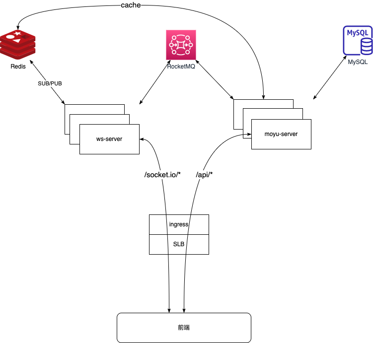
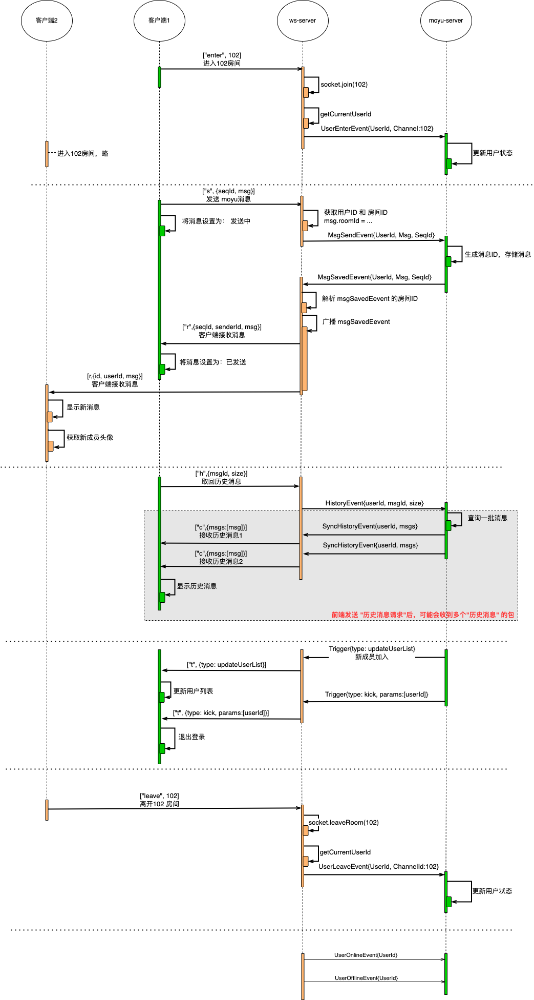

# 概要设计

[[_TOC_]]

## 1. 整体架构



## 2. 服务职责分工

### ws-server

- 负责客户端接入：负责ws接入鉴权，和客户端建立稳定的web socket通道；
- 负责将客户端发送的消息，经过MQ 传递给 业务服务处理；
- 消息广播，负责将 业务服务 需要下发 的消息广播到同一个房间(room)
- 消息下发，负责将 某个确定的消息 发送 给用户；

### moyu-server

- 维护用户以及用户状态
- 维护会话状态
- 存储消息

## 3. 信令设计 & 收发消息

> 这里以客户端的视角来观察；收消息，指客户端收消息；发消息，指客户端发消息；

### 3.1 信令列表

- [发送]进入房间
    ```js
    //["enter", 房间ID]
    const enterCommand = "enter"
    const channelId = 100;
    socket.emit(enterCommand, channelId)
    ```
- [发送]离开房间
    ```js
    //["leave", 房间ID]
    const leaveCommand = "leave"
    const channelId = 100;
    socket.emit(leaveCommand, channelId)
    ```


- 发送消息
    ```js
    // ["s",{seqId, msg}]
    const sendCommand = "s" //发消息，信令标记；
    let seqId = 1 //信令ID，客户端使用不重复的Number类型表示
    let commandUserId = 1 //用户ID，登录时获取
    let msg = {
        userId: 11,
        channelId: 102,
        content: {
            "type": "text",
            "text":"今天吃了吗？"
        },
    } //具体要发送的消息，根据消息定义进行填充
    
    socket.emit(sendCommand, {seqId: seqId, msg})
    ```

- 接收消息
    ```js
    // ["r",{seqId, senderId, msg}]
    const receiveCommand = "r" //收消息，信令标记；
  
    socket.on(receiveCommand, ({seqId, senderId, msg})=>{
        const{id, createdAt, userId, channelId, content }=msg
  
        // 信令ID，客户端使用不重复的Number类型表示
        // userId, 消息来源用户
        // msg, 具体要接收的消息
    })
    ```
  
- 确认消息接收
    ```js
    //["a",{channleId,userId,msgId}]; ⚠️后端会记录已读消息的偏移量，即 该指令会把该频道下 消息Id 小于等于 `msgId` 的所有消息都确认掉；
    const ackCommand = "a"
    socket.emit(ackCommand, {channleId,msgId})
    ```

- 发送"历史消息请求"

    ```js
    // ["h",{msgId, size}] 
    // 获取 ${msgId} 之前的 ${size} 条消息
    const historyCommand = "h"; //信令标记
    const channelId = 102; // 频道Id
    const msgId = 1000;    // 当前消息ID，如果 msgId=0，服务器将重发最近${size}条消息
    const size = 2000;     // 获取消息条数
    
    socket.emit(historyCommand, {channelId, msgId, size})
    ```
  - ⚠️size 为 为**正数**时，表示向后获取 `|size|`条消息；  
  - ⚠️size 为 为**负数**时，表示向前获取 `|size|`条消息；  

- 接收"历史消息"
    ```js
    // ["c", msgs]
    const syncHistoryCommand = "c"
    socket.on(syncHistoryCommand, (msgs)=>{
        // msgs 消息列表，每个packet最多100条msg，超过100条分多个 packet 返回
    })
    ```

- [接收]Trigger(触发器)
    ```js
    //["t",{type, params:[]}]
    const triggerCommand = "t"
    socket.on(triggerCommand, ({type, params})=>{
        // type, 触发器类型
        // params,触发器参数
    })
    ```
  **触发器类型:**
    - updateUserList: 更新用户列表
    - kick： 踢人下线
    - updateChannelList: 更新频道列表
    - eventChannelDeleted: 频道被删除事件 params[0] = channelId
    - loginSuc: 扫描登录成功
    - notice: 消息通知 (params[0] = noticeId)
    - removedFromChannel: 用户被从频道移出 (params[0] = channelId)
    - approvalAudited: 用户发起的审批单已被审批 (params[0] = {
          id: 2,
          approvalType: "channel-join",   // 审批类型
          businessId: 3343, // channel-join 类型的审批，businessId 为 channelId
          createdAt: "",  // 创建时间
          reason: "申请理由",
          userId: 24,
          state: 1, // (审批状态, 0. 待审核, 1. 审核通过, 2. 审核驳回)
      } )

### 3.2 信令流程设计



### 3.3 消息结构

`msg` 消息格式如下：

```json
{
  "id": 201111,
  "createdAt": "2022-09-22T07:13:12.211Z",
  "userId": 100,
  "channelId": 2222,
  "content": {}
}
```

`msg.content` 消息结构如下

- 文本消息content

    ```json
    {
      "reference": 33,
      "type": "text",
      "text": "xxxx"
    }
    ```

- 图片消息content

    ```json
    {
      "reference": 33, 
      "type": "image",
      "url": "https://xx/xxx"
    }
    ```

- 表情消息content

    ```json
    {
      "reference": 33,
      "type": "emoticon",
      "emoticonId": 1,
      "emoticonName": "表情名",
      "url": "https://xxx/xxx"
    }
    ```
  
- 表情回复消息content
    > "表情回复消息"，是一种特殊消息，只能在消息后的按钮上触发；  
    用户发送消息时，消息内容发送给服务器，消息不单独展示，而是跟在被回复消息后面；  
    用户收到 receiveCommand 时，消息也不单独展示，跟在被回复消息后面； 
    获取历史消息时，该消息不独立返回，而是作为被回复消息的扩展，放到被回复消息的reply字段中；

    ```json
    {
      "type": "emoticon-reply",
      "reference": 33,
      "emoticonId": 1,
      "emoticonName": "大笑"
    }
    ```
    
    - 被回复的消息：
      ```js
      let msg = {
        //... 消息其他字段
        "reply": [{
            userId: 10,
            emoticonId: 20,
        }]
      }
      ```

  
- 文件消息content
    ```json
    {
      "reference": 33,
      "type": "file",
      "fileName": "吃瓜手册",
      "fileType": "pdf",
      "url": "https://xxx/xxx",
      "fileSize": 100
    }
    ```
    -  其中
        
       | 字段       | 字段类型   | 含义        |
       |----------|--------|-----------|
       | fileName | string | 文件名      |  
       | fileType | string | 文件类型      |
       | url      | Url    | 文件在OSS的地址 |
       | fileSize | number | 文件大小，单位字节 |

- 群公告消息 Content
 
    ```json
    {
      "reference": 33,
      "type": "channel-notice",
      "notice": "群公告"
    }
    ```

- 声音消息 Content

    ```json
    {
      "reference": 33,
      "type": "voice",
      "url": "https:///xxx/xxx",
      "duration": 31 
    }
    ```
-  其中

   | 字段  | 字段类型   | 含义       |
   |----------|----------|-----------|
   | url | Url    | 件在OSS的地址 |
   | duration   | number | 时长 (s)   |


## 4. token 设计

- token生成方式：`JWT` SHA256 签名
- token传递使用：`Cookie` + `Secure` + `HttpOnly`
- token有效期 和 `Cookie` 有效期 保持一致
- token的hash值记录到 `Redis`，暂不允许用户多设备登录【此处要留多设备登录的可能性】

## 5. WS服务事件

- 用户状态类
    - UserEnterEvent  
      用户进入房间，事件由`ws-server`发出，业务服务订阅；
    - UserLeaveEvent  
      用户离开房间，事件由`ws-server`发出，业务服务订阅；
    - UserOnlineEvent  
      用户在线，事件由`ws-server`发出，业务服务订阅；
    - UserOfflineEvent  
      用户离线，事件由`ws-server`发出，业务服务订阅；
- IM消息相关
    - MsgSendEvent  
      消息发送事件，该事件携带用户发送的消息，由`ws-server`发出，业务服务订阅；
    - MsgSavedEvent  
      消息保存时间，该事件表示业务服务器将消息已经保存，由业务服务发出，`ws-server`订阅并广播到房间；
    - HistoryEvent  
      历史消息事件，该事件触发业务服务向用户同步历史消息，由`ws-server`发出，业务服务订阅；
    - SyncHistoryEvent  
      同步历史消息，该事件携带历史消息，由业务服务发出，`ws-server`订阅并转发给客户端；
- 触发器相关
    - TriggerEvent  
      该事件用于触发客户端的某种行为，由业务服务发出，`ws-server`订阅并转发给客户端；

## 6. 业务模型和数据库设计

### 5.1、星球管理

```sql
create table planet
(
    id          bigint unsigned primary key auto_increment comment 'ID',
    `name`      varchar(128) not null comment '星球名称',
    icon        varchar(128) not null comment '星球图标',
    front_cover varchar(256) not null comment '星球封面',
    created_at  datetime     not null default now() comment '创建时间'
);
```

```sql
create table planet_member
(
    id         bigint unsigned primary key auto_increment comment 'ID',
    planet_id  bigint unsigned not null comment '星球ID',
    user_id    bigint unsigned not null comment '用户ID',
    `role`     int unsigned    not null comment '角色',
    `status`   int unsigned    not null comment '用户状态',
    created_at datetime        not null default now() comment '创建时间'
);
create index idx_planet_id
    on planet_member (planet_id);
```

### 5.2 频道管理

#### 5.2.1. 数据库设计

##### (1) 频道

```sql
create table channel
(
    id         bigint unsigned primary key auto_increment comment 'ID',
    `name`     varchar(128) not null comment '频道名称',
    icon       varchar(128) not null comment '频道图标',
    group_id   bigint unsigned comment '频道所属组ID',
    planet_id  bigint unsigned comment '星球ID',
    sort       int unsigned comment '排序',
    created_by bigint unsigned comment '创建人ID',
    created_at datetime     not null default now() comment '创建时间'
);
create index idx_planet_id
    on channel (planet_id);
```

##### (2) 频道组

```sql
create table channel_group
(
    id         bigint unsigned primary key auto_increment comment 'ID',
    `name`     varchar(128) not null comment '组名称',
    icon       varchar(128) not null comment '组图标',
    planet_id  bigint unsigned comment '星球ID',
    created_by bigint unsigned comment '创建人ID',
    created_at datetime     not null default now() comment '创建时间'
);
create index idx_planet_id
    on channel_group (planet_id);
```

##### (3) 订阅

```sql
create table channel_subscription
(
    id         bigint unsigned primary key auto_increment comment 'ID',
    channel_id bigint unsigned not null comment '频道ID',
    user_id    bigint unsigned not null comment '用户ID',
    created_at datetime        not null default now() comment '创建时间',
    unique (channel_id, user_id)
);
create index idx_channel_id
    on channel_subscription (channel_id);
```

* 注意： 后续如果做频道角色则在其中增加相关字段，与全局角色隔离

### 5.3 用户管理

#### 5.3.1. 数据库设计

##### (1) 用户

```sql
create table user
(
    id          bigint unsigned primary key auto_increment comment 'ID',
    nickname    varchar(128)       not null comment '昵称',
    avatar      varchar(128)       not null comment '头像URL',
    wx_open_id  varchar(64) unique not null comment '微信OpenId',
    wx_union_id varchar(64)        not null comment '微信UnionId',
    `status`    int unsigned       not null default 0 comment '用户状态: 0.正常 1.黑名单',
    `online`    tinyint            not null default 0 comment '是否在线',
    created_at  datetime           not null default now() comment '创建时间'
)
```

```sql
create table user_setting
(
    id           bigint unsigned primary key auto_increment comment 'ID',
    user_id      bigint unsigned unique not null comment 'ID',
    end_off_time varchar(32)            not null comment '下班时间',
    boss_key     varchar(32)            not null comment '老板键'
);
```

##### (2) 权限模型

由于

* 后续版本权限会修改为频道级别，目前并不是最终形态
* 业务模型比较简单，且是固定角色和固定权限，没有灵活动态配置的需求,没有权限细粒度拆分的需求

故权限模型直接采用简单角色标识，最简化处理当前简单的权限场景

| 角色标识 | 名称    | 说明                  |
|------|-------|---------------------|
| 0    | 普通成员  | 无特殊权限               |
| 1    | 管理员   | 频道管理，用户黑名单          |
| 2    | 超级管理员 | 频道管理，用户黑名单,提升用户为管理员 |

### 5.4、聊天记录

```sql
create table message_record
(
    id                bigint unsigned primary key auto_increment comment 'ID',
    message_timestamp datetime        not null comment '消息发生时间',
    message_type      int unsigned    not null comment '消息类型: 0. 文本消息, 1. 图片消息',
    channel_id        bigint unsigned not null comment '频道ID',
    sender_id         bigint unsigned not null comment '用户ID',
    content           varchar(1024)   not null comment '消息内容',
    created_at        datetime        not null comment '创建时间'
)
```

### 5.5、辞职模板

```sql
CREATE TABLE `resign_template`
(
    id      bigint unsigned NOT NULL AUTO_INCREMENT COMMENT '自增主键',
    title   varchar(255)    NOT NULL COMMENT '模板标题',
    content text            NOT NULL COMMENT '模版内容',
    PRIMARY KEY (`id`)
)
```
